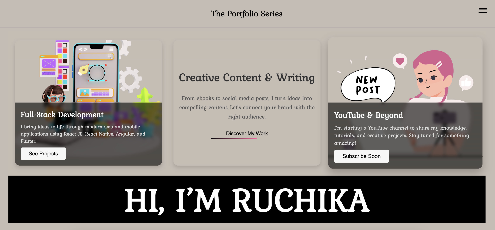

# Ruchika's Portfolio (React + Vite)

<div align="center">



</div>

A modern, animated personal portfolio built with React and Vite. It showcases projects, skills, work experience, and includes an EmailJS-powered contact form. The UI uses styled-components and subtle motion via Framer Motion. Routing is handled with React Router.

— Maintained by: [ruchika216](https://github.com/ruchika216)

## ✨ Features

- Responsive, elegant design inspired by editorial layouts
- Animated hero, cards, orbit elements, and velocity scroll effects
- Projects with interactive hover states and detailed pages
- Skills, career history, and work experience sections
- Downloadable resume (PDF)
- Contact form integrated with EmailJS
- Client-side routing with React Router
- Zero-config local dev via Vite with fast HMR

## 🧰 Tech Stack

- React 18 + Vite 6
- styled-components
- Framer Motion
- React Router DOM
- React Bootstrap (UI helpers) and React Icons
- EmailJS Browser SDK
- Utilities: react-fast-marquee, react-infinite-scroll-component, react-pdf

## 📁 Project Structure (high level)

```
src/
	assets/            # Images and static assets
	components/        # Reusable UI components
		common/          # Hero, Navbar, Skills, Projects, etc.
	pages/             # Route pages (Home, About, Work, Contact, etc.)
	App.jsx            # Routes wiring
	main.jsx           # App bootstrap
public/
	resume.pdf         # Downloadable resume
	portfolio-cover.png# README cover image (add the attached image here)
```

## 🚀 Getting Started

Prerequisites: Node.js 18+ and npm.

Install dependencies and start the dev server:

```bash
npm install
npm run dev
```

Build for production and preview locally:

```bash
npm run build
npm run preview
```

Lint:

```bash
npm run lint
```

## 🔐 EmailJS Setup (Contact form)

This project uses EmailJS on the Contact page. Replace the placeholders with your own keys or move them to environment variables.

- Service ID: `service_xxx`
- Template ID: `template_xxx`
- Public Key: `xxxxxx`

Code reference: `src/pages/Contact.jsx`.

Tip: Prefer Vite environment variables via `.env`:

```
VITE_EMAILJS_SERVICE_ID=...
VITE_EMAILJS_TEMPLATE_ID=...
VITE_EMAILJS_PUBLIC_KEY=...
```

Then read them in code with `import.meta.env.VITE_EMAILJS_SERVICE_ID`, etc.

## 📸 Screenshots

- The banner above is saved as `public/portfolio-cover.png`.
  If it doesn’t render on GitHub, ensure the attached screenshot is saved at that path (or update the `` path in this README).

## 🧭 Routes

- `/` Home
- `/projects` Projects
- `/work` Work / Experience
- `/about` About
- `/contact` Contact

Actual route components live under `src/pages/` and are wired in `App.jsx`.

## 🛠️ Scripts

- `npm run dev` – Start Vite dev server
- `npm run build` – Production build
- `npm run preview` – Preview prod build
- `npm run lint` – Run ESLint

## 🌐 Deployment

- Vercel or Netlify: Import the repo, keep defaults (build: `vite build`, output: `dist`).
- GitHub Pages: Build and publish `dist/` using your preferred action.

## 👤 Author

- GitHub: [@ruchika216](https://github.com/ruchika216)

## 📄 License

This repository is for a personal portfolio. If you reuse code, please include attribution.
